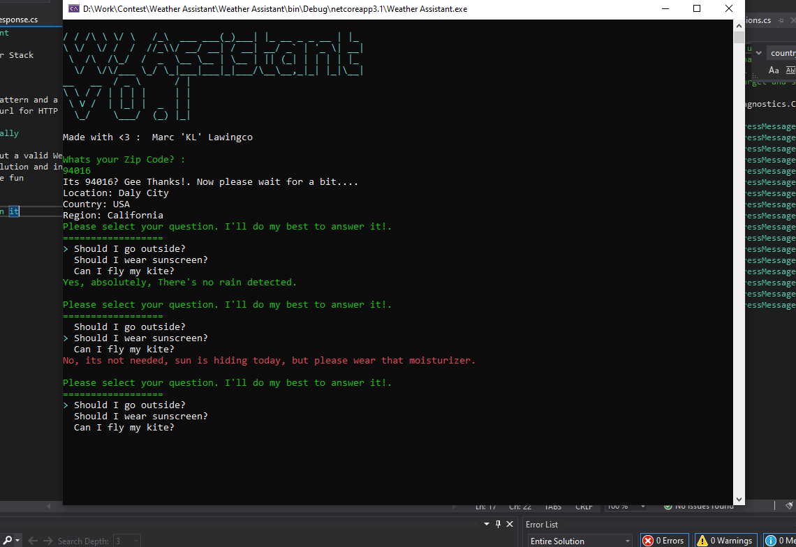

# Weather Assistant

Powered by Weather Stack

## Architecture

Heavily uses DI pattern and a semi Onion design pattern but instead of different project a different folder is used instead.
This also uses Flurl for HTTP Connection and Linq for some array/queryable/ienumerable manipulation

## How to run locally

1. Make sure to put a valid WeatherStack API KEY to appsettings.json
2. Rebuild the solution and install the packages.
3. Run it and Have fun

## A quick demo on it

